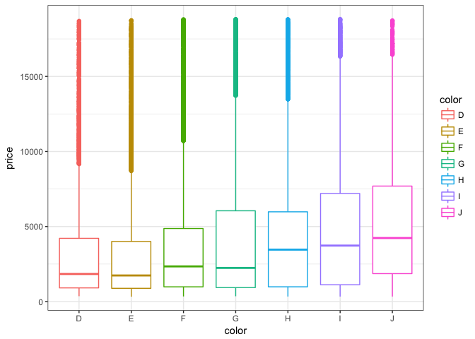
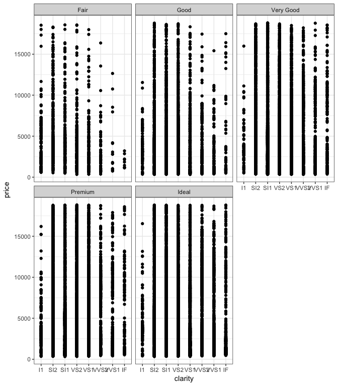

# Diamonds- A girl's best friend or a waste of money?


## Introduction 
A diamond is a metastable allotrope of carbon, where the carbon atoms are arranged in a variation of the face-centered cubic crystal structure called a diamond lattice. Diamond is less stable than graphite, but the conversion rate from diamond to graphite is negligible at standard conditions. Diamond is renowned as a material with superlative physical qualities, most of which originate from the strong covalent bonding between its atoms.

These physical qualities are what draw men and women in North America to exchange diamond rings as a symbol of their love and commitment to one another. Diamonds come in a wide variety of colors, shapes, cuts and sizes. Here we analyze the characteristics of 53940 diamonds and include our code for easy reproducible analysis. 

## Dataset
Our dataset comes from the ggplot2 package. It includes several features:

1. carat
2. cut
3. color
4. clarity
5. price
6. depth

The depth of the diamond is composed of three measurements which we will *not* cover today.

Here is an example of how the dataset is organized: 


```
## # A tibble: 6 × 10
##   carat       cut color clarity depth table price     x     y     z
##   <dbl>     <ord> <ord>   <ord> <dbl> <dbl> <int> <dbl> <dbl> <dbl>
## 1  0.23     Ideal     E     SI2  61.5    55   326  3.95  3.98  2.43
## 2  0.21   Premium     E     SI1  59.8    61   326  3.89  3.84  2.31
## 3  0.23      Good     E     VS1  56.9    65   327  4.05  4.07  2.31
## 4  0.29   Premium     I     VS2  62.4    58   334  4.20  4.23  2.63
## 5  0.31      Good     J     SI2  63.3    58   335  4.34  4.35  2.75
## 6  0.24 Very Good     J    VVS2  62.8    57   336  3.94  3.96  2.48
```

## Statistics 
The mean carat size of all of the diamonds in the dataset was 0.7979397. 

The mean price of all of the diamonds in the dataset was 3932.7997219.

You can compute the summary statistics of all of the features by running:


```r
summary(diamonds)
```

## Plots 

First we were interested if there was a relationship between the color of the diamond and the cost of the diamond: 

```r
ggplot(diamonds, aes(x=color, y=price)) +geom_boxplot(aes(color=color)) +theme_bw()
```

<!-- -->

It seems there is _not_ a pattern between color and price. 

See next page for continued analysis. 

\clearpage

Next we wanted to know if there was a relationship between the clarity of the diamond and the price:


```r
ggplot(diamonds, aes(x=clarity, y=price)) +geom_point() + theme_bw() + facet_wrap(~cut)
```

<!-- -->


